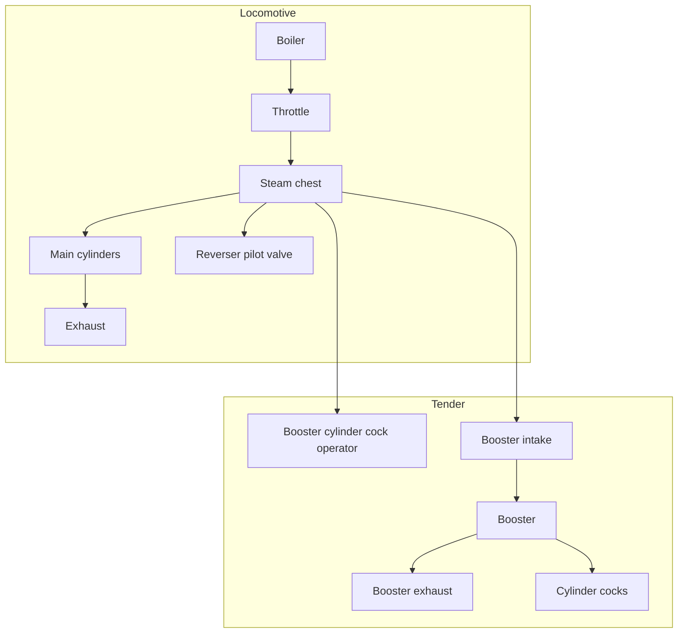
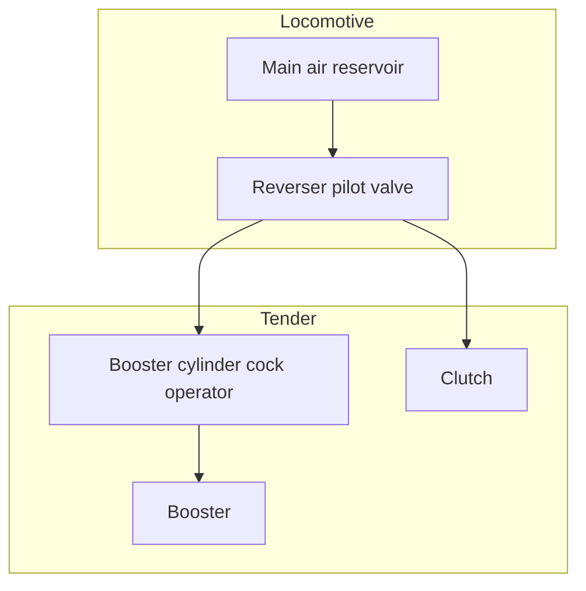
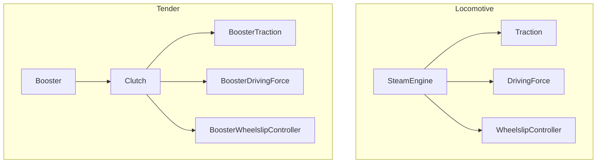

# Boosters
Here's how steam flows:

Here's how air flows:

And here's how torque flows:

This isn't quite how it works in real life; I'm not simulating the dome pilot valve or the preliminary throttle valve. Instead, that behavior is integrated into the `BoosterCylinderCockOperator` and the `ReverserPilotValve`.
