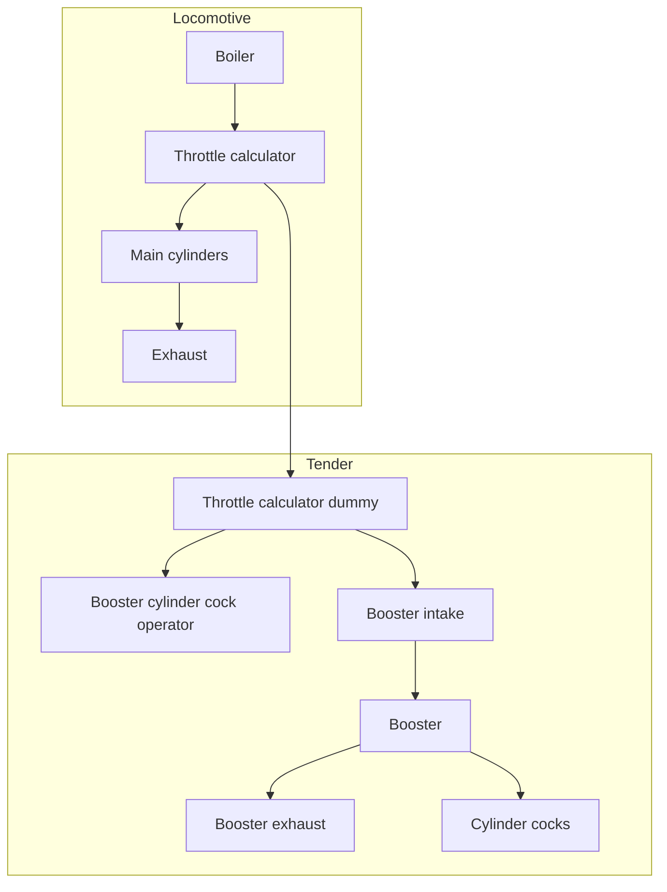
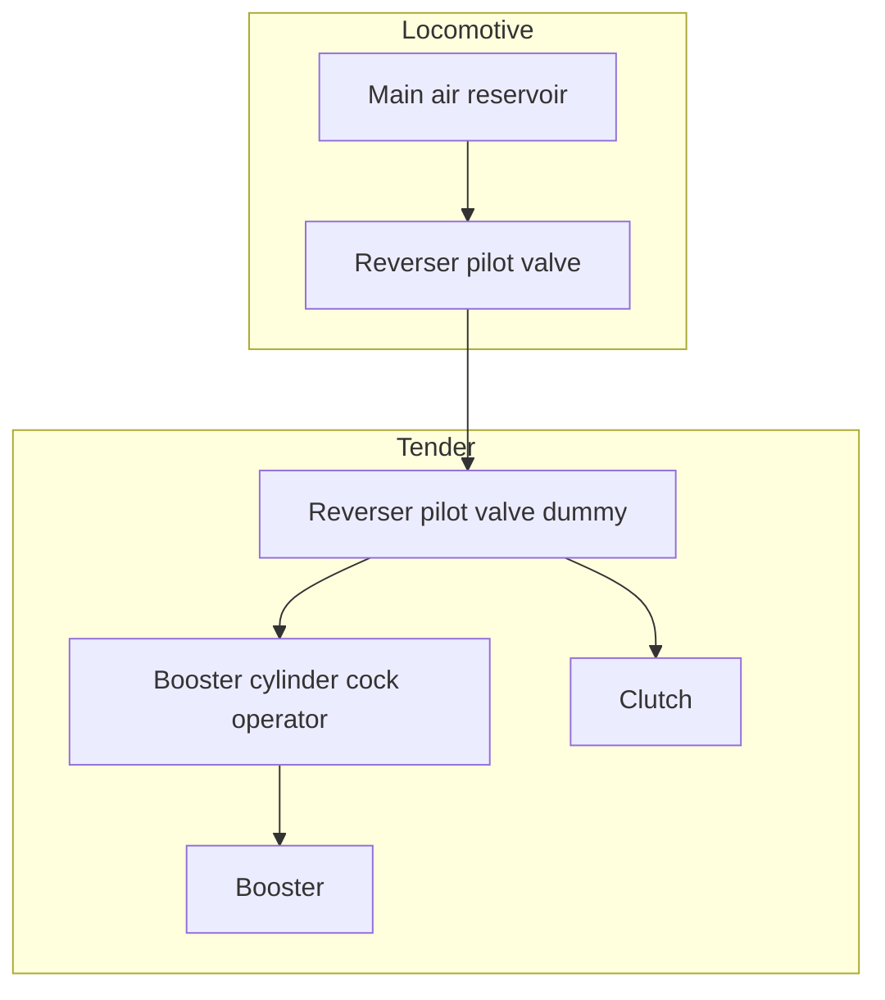
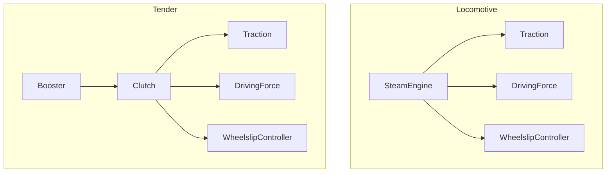

# Boosters
Here's how steam flows:

Here's how air flows:

And here's how torque flows:

This isn't quite how it works in real life; we're not simulating the dome pilot valve or the preliminary throttle valve. Instead, that behavior is integrated into the `BoosterCylinderCockOperator` and the `ReverserPilotValve`.

There are also now connections between the locomotive and the tender for lubrication (taken from the mechanical lubricator), "steam quality" (I forget what this is but it's taken from the boiler) and steam temperature (taken from the firebox, because on the S282 the steam temp is the same as the fire temp).
